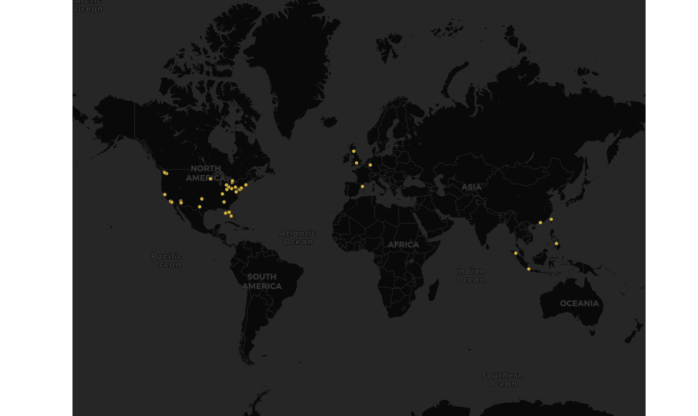

# Lab2 GEOG458

### Spec: "... write a short narrative of your map, analyzing the data you gathered in a markdown file."

**Context**

My map plots geotagged tweets that contains "#wallstreetbets". Wallstreetbets (also known as wsb) is a subreddit that focuses on investing in the stock market. During this past week wallstreetbets has become an increasingly common name in the news due to the crazy events going on in the stock market reagrding $GME, $AMC, $BBBY stocks. A bit of background on the situation simply - a company saw an opportunity to make profit by betting against (short selling) gamestop ($GME), but the people of reddit saw this opportunity to make profit and send message to short sellers. Hence, the people of reddit skyrocketed the share price of $GME causing huge losses for the short sellers (short squeeze). No need to further explain the complex situation, the big takeaway from this is that a unprecednted event took place this week in the stock market. 

**Why is this so interesting?** 

All of the ongoings with $GME triggered investments in other companies in similar situations and led people to scramble to try to make profit. 
However, amidst all the scramble a lot of questions were raised regarding not only the legality but also the ethics of manipulating the stock market online. 

Asides from the legality and ethics questions raised, the situation led to the trading app, Robin Hood, to pause buying of stocks which has led to a class action lawsuit in the past few days. 

**Analysis**

With all the action regarding the stock market in the past several days I thought it would be interesting to  map the tweets in regard to "wallstreetbets" to see what areas and demographics would be most affected by the news and ongoing activities. I ran the crawler for two hours and not many data points were collected. Although not many points were collected I think the map still can provide some insight to the popularity and impact of the situation. There seems to be a denser population on the east coast of the United States, that could be due to the fact that wall street and stock markets are very popular near the physical location of trading. There is a spread of hits across the United States which is as as expected since the topic pertains to the Unites States but its interesting to see that there is some influence or discussion on the topic abroad in Europe and Southeast Asia. It is interesting that in the United States it seems that larger more metropolitan areas have hits where as areas the central/midwest regions do not mention much. I think this could be due to the fact that stock markets and trading are associated with wealthier demographics and more western areas. 